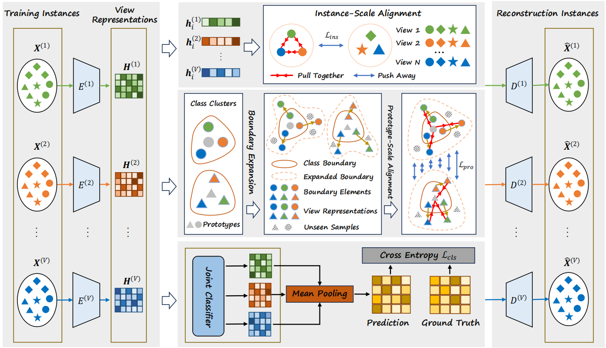

<table>
  <tr>
    <!-- 左边放图片 -->
    <td width="40%">
      
    </td>
    <!-- 右边放论文介绍 -->
    <td width="50%">
      <h3>Enhance Multi-View Classification through Multi-Scale Alignment and Expanded Boundary</h3>
      

        <strong>Y. Lin</strong>, Y. Wang, G. Lyu, Y. Deng, H. Cai, H. Lin, H. Wang, Z. Yang. [[Paper]](https://openreview.net/pdf?id=t1J2CnDFwj)
        In this paper, we propose MAMC to address the problems caused by the feature heterogeneity and the information redundancy. Through introducing the multi-scale alignment module, MAMC sufficiently mines the inter-view commonality to tighten instances and inter-class difference to delimit the decision boundaries.
      

    </td>
  </tr>
</table>

<!-- - <strong>Y. Lin</strong>, Y. Wang, G. Lyu, Y. Deng, H. Cai, H. Lin, H. Wang, Z. Yang. Enhance Multi-View Classification through Multi-Scale Alignment and Expanded Boundary. International Conference on Learning Representations, 2025. (TH-CPL A) [[Paper]](https://openreview.net/pdf?id=t1J2CnDFwj) -->

<table>
  <tr>
    <!-- 左边放图片 -->
    <td width="40%">
      
    </td>
    <!-- 右边放论文介绍 -->
    <td width="50%">
      <h3>Fuzzy Neural Network for Representation Learning on Uncertain Graphs</h3>
      

        <strong>Y. Lin</strong>, H. Cai, C. Zhang, C. Chen. [[Paper]](https://ieeexplore.ieee.org/abstract/document/10571582/)
        In this paper, we propose a general fuzzy representation framework that transforms a crisp graph encoder into a fuzzy graph encoder. The fuzzy encoder could generate interval representations by considering the data uncertainties. Then the interval representations are defuzzified to filter out the uncertainties.
      

    </td>
  </tr>
</table>

<!-- - <strong>Y. Lin</strong>, H. Cai, C. Zhang, C. Chen. Fuzzy Neural Network for Representation Learning on Uncertain Graphs, IEEE Transactions on Fuzzy Systems. 32(9): 5259-5271, 2024. (JCR Q1, CCF B) [[Paper]](https://ieeexplore.ieee.org/abstract/document/10571582/) -->

<table>
  <tr>
    <!-- 左边放图片 -->
    <td width="40%">
      
    </td>
    <!-- 右边放论文介绍 -->
    <td width="50%">
      <h3>Fuzzy Representation Learning on Graphs</h3>
      

        C. Zhang, <strong>Y. Lin</strong>, C. Chen, H. Yao, H. Cai, W. Fang. [[Paper]](https://ieeexplore.ieee.org/abstract/document/10061283/)
        In this paper, a fuzzy graph encoder is proposed to extract the hidden fuzzy knowledge in the features. We explain why integrating fuzzy knowledge into the crisp representations could improve the expressiveness and model performance.
      

    </td>
  </tr>
</table>

<!-- - C. Zhang, <strong>Y. Lin</strong>, C. Chen, H. Yao, H. Cai, W. Fang. Fuzzy Representation Learning on Graphs, IEEE Transactions on Fuzzy Systems. 31(10): 3358-3370, 2023. (JCR Q1, CCF B) [[Paper]](https://ieeexplore.ieee.org/abstract/document/10061283/) -->

<table>
  <tr>
    <!-- 左边放图片 -->
    <td width="40%">
      
    </td>
    <!-- 右边放论文介绍 -->
    <td width="50%">
      <h3>Multiple Views to Free Graph Augmentations</h3>
      

        C. Zhang, <strong>Y. Lin</strong>, C. Chen, H. Yao, H. Cai, W. Fang. [[Paper]](https://ieeexplore.ieee.org/abstract/document/10342655/)
        Graph augmentations would cause troublesome problems, and we design a multi-view learning model to free the graph augmentations. Specifically, we propose a fuzzy view of the crisp view and explain that the fuzzy view could generate the adaptive hard positives for the raw graph. By learning the hard positives, we give up the need for graph augmentations. 
      

    </td>
  </tr>
</table>

  <!-- 左边放图片 -->
  

    
  

  <!-- 右边放论文介绍 -->
  

      <h3>Multiple Views to Free Graph Augmentations</h3>
      

        <strong>Y. Lin</strong>, H. Cai, C. Zhang, C. Chen. [[Paper]](https://ieeexplore.ieee.org/abstract/document/10342655/)
        Graph augmentations would cause troublesome problems, and we design a multi-view learning model to free the graph augmentations. Specifically, we propose a fuzzy view of the crisp view and explain that the fuzzy view could generate the adaptive hard positives for the raw graph. By learning the hard positives, we give up the need for graph augmentations. 
      

  

<!-- - <strong>Y. Lin</strong>, H. Cai, C. Zhang, C. Chen. Multiple Views to Free Graph Augmentations, IEEE Transactions on Computational Social Systems. 11(3): 3290-3230, 2024. (JCR Q1, CCF C) [[Paper]](https://ieeexplore.ieee.org/abstract/document/10342655/) -->

- H. Wei, Y. Deng, Q. Hai, <strong>Y. Lin</strong>, Z. Yang, G. Lyu. Multi-View Multi-Label Classification via View-Label Matching Selection, AAAI Conference on Artificial Intelligence, 2025. (CCF A)

- B. Sun, Y. Deng, <strong>Y. Lin</strong>, Q. Hai, Z. Yang, G. Lyu. Graph Consistency and Diversity Measurement for Federated Multi-View Clustering, AAAI Conference on Artificial Intelligence, 2025. (CCF A)

- Q. Hai, Y. Deng, <strong>Y. Lin</strong>, Z. Li, Z. Yang, G. Lyu. CFDM: Contrastive Fusion and Disambiguation for Multi-View Partial-Label Learning, AAAI Conference on Artificial Intelligence, 2025. (CCF A)
