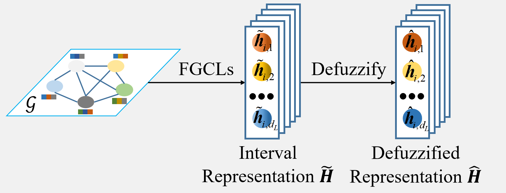
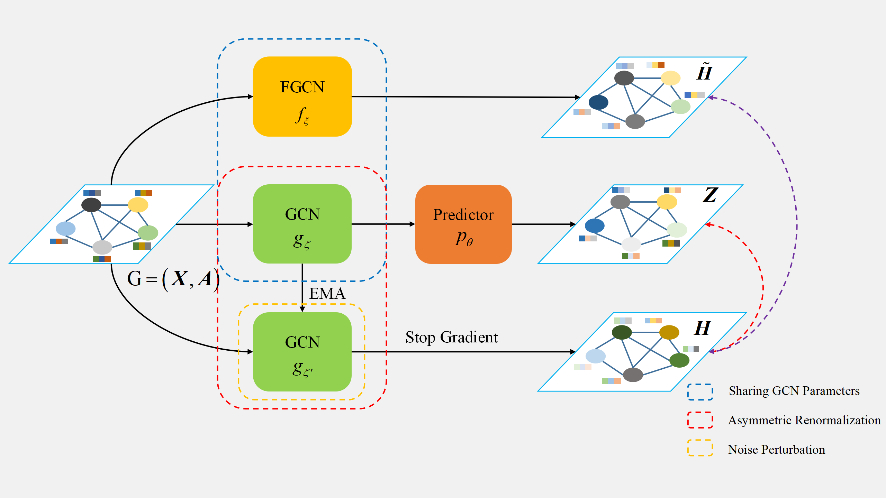

  <!-- 左边放图片 -->
  

    
  

  <!-- 右边放论文介绍 -->
  

      <h3>Hypergraph-Based Multi-View Multi-Label Classification via Adaptive High-Order Semantic Fusion</h3>
      <a src="" target="_blank">[Paper]</a>
      
Y. Shan, L Gao, <strong>Y. Lin</strong>, Z. Yang, G. Lyu, H. Han.

      
AAAI Conference on Artificial Intelligence, 2026.

  

  <!-- 左边放图片 -->
  

    
  

  <!-- 右边放论文介绍 -->
  

      <h3>CCAHCL: Multi-Level Hypergraph Contrastive Learning for Connected Component Awareness</h3>
      <a src="" target="_blank">[Paper]</a>
      
Z. Li, G. Lyu, <strong>Y. Lin</strong>, Z. Chen, Z. Ma, Z. Yang, Z. Li.

      
AAAI Conference on Artificial Intelligence, 2026.

  

  <!-- 左边放图片 -->
  

    
  

  <!-- 右边放论文介绍 -->
  

      <h3>AF-UMC: An Alignment-Free Fusion Framework for Unaligned Multi-View Clustering</h3>
      <a src="" target="_blank">[Paper]</a>
      
B. Sun, <strong>Y. Lin</strong>, T. Yang, Z. Zhu, Z. Yang, G. Lyu.

      
Neural Information Processing Systems, 2025.

  

  <!-- 左边放图片 -->
  

    
  

  <!-- 右边放论文介绍 -->
  

      <h3>CaliGCL: Calibrated Graph Contrastive Learning via Partitioned Similarity and Consistency Discrimination</h3>
      <a src="" target="_blank">[Paper]</a>
      
<strong>Y. Lin</strong>, H. Wei, H. Cai, B. Sun, T. Yang, Z. Yang.

      
Neural Information Processing Systems, 2025.

  

  <!-- 左边放图片 -->
  

    
  

  <!-- 右边放论文介绍 -->
  

      <h3>Simplified Graph Contrastive Learning Model without Augmentation</h3>
      <a src="" target="_blank">[Paper]</a>
      
<strong>Y. Lin</strong>, G. Lyu, H. Cai, D. Wang, H. Wang, Z. Yang.

      
IEEE Transactions on Knowledge and Data Engineering, 2025.

  

  <!-- 左边放图片 -->
  

    
  

  <!-- 右边放论文介绍 -->
  

      <h3>Mitigating Local Cohesion and Global Sparseness in Graph Contrastive Learning with Fuzzy Boundaries</h3>
      <a src="../static/assets/publication/icml25_mitigate.pdf" target="_blank">[Paper]</a>
      
<strong>Y. Lin</strong>, H. Cai, J. Wang, H. Wang, Z. Yang, G. Lyu.

      
The 42nd Internation Conference on Machine Learning, 2025.

  

  <!-- 左边放图片 -->
  

    
  

  <!-- 右边放论文介绍 -->
  

      <h3>Critical Node-aware Augmentation for Hypergraph Contrastive Learning</h3>
      <!-- <a src="../static/assets/publication/icml25_mitigate.pdf" target="_blank">[Paper]</a> -->
      
Z. Li, <strong>Y. Lin</strong>, Y. Wang, W. Liu, M. Yu, Z. Yang, G. Lyu.

      
Internation Joint Conference on Artificial Intelligence, 2025.

  

  <!-- 左边放图片 -->
  

    
  

  <!-- 右边放论文介绍 -->
  

      <h3>Enhance Multi-View Classification through Multi-Scale Alignment and Expanded Boundary</h3>
      <a href="https://openreview.net/pdf?id=t1J2CnDFwj" target="_blank">[Paper]</a>
      
<strong>Y. Lin</strong>, Y. Wang, G. Lyu, Y. Deng, H. Cai, H. Lin, H. Wang, Z. Yang.

      
The 13rd Internation Conference on Learning Representations, 2025.

  

<!-- - <strong>Y. Lin</strong>, Y. Wang, G. Lyu, Y. Deng, H. Cai, H. Lin, H. Wang, Z. Yang. Enhance Multi-View Classification through Multi-Scale Alignment and Expanded Boundary. International Conference on Learning Representations, 2025. (TH-CPL A) [[Paper]](https://openreview.net/pdf?id=t1J2CnDFwj) -->

  <!-- 左边放图片 -->
  

    
  

  <!-- 右边放论文介绍 -->
  

      <h3>Fuzzy Neural Network for Representation Learning on Uncertain Graphs</h3>
      <a href="https://ieeexplore.ieee.org/abstract/document/10571582/" target="_blank">[Paper]</a>
      
<strong>Y. Lin</strong>, H. Cai, C. Zhang, C. Chen.

      
IEEE Transactions on Fuzzy Systems, Volume 32(9), Pages 5259-5271, 2024.

  

<!-- - <strong>Y. Lin</strong>, H. Cai, C. Zhang, C. Chen. Fuzzy Neural Network for Representation Learning on Uncertain Graphs, IEEE Transactions on Fuzzy Systems. 32(9): 5259-5271, 2024. (JCR Q1, CCF B) [[Paper]](https://ieeexplore.ieee.org/abstract/document/10571582/) -->

  <!-- 左边放图片 -->
  

    
  

  <!-- 右边放论文介绍 -->
  

      <h3>Fuzzy Representation Learning on Graphs</h3>
      <a href="https://ieeexplore.ieee.org/abstract/document/10061283/" target="_blank">[Paper]</a>
      
C. Zhang, <strong>Y. Lin</strong>, C. Chen, H. Yao, H. Cai, W. Fang.

      
IEEE Transactions on Fuzzy Systems, Volume 31(10), Pages 3358-3370, 2023.

  

<!-- - C. Zhang, <strong>Y. Lin</strong>, C. Chen, H. Yao, H. Cai, W. Fang. Fuzzy Representation Learning on Graphs, IEEE Transactions on Fuzzy Systems. 31(10): 3358-3370, 2023. (JCR Q1, CCF B) [[Paper]](https://ieeexplore.ieee.org/abstract/document/10061283/) -->

  <!-- 左边放图片 -->
  

    
  

  <!-- 右边放论文介绍 -->
  

      <h3>Multiple Views to Free Graph Augmentations</h3>
      <a href="https://ieeexplore.ieee.org/abstract/document/10342655/" target="_blank">[Paper]</a>
      
<strong>Y. Lin</strong>, H. Cai, C. Zhang, C. Chen.

      
IEEE Transactions on Computational Social Systems, Volume 11(3), Pages 3920-3930, 2024.

  

<!-- - <strong>Y. Lin</strong>, H. Cai, C. Zhang, C. Chen. Multiple Views to Free Graph Augmentations, IEEE Transactions on Computational Social Systems. 11(3): 3290-3230, 2024. (JCR Q1, CCF C) [[Paper]](https://ieeexplore.ieee.org/abstract/document/10342655/) -->

- H. Wei, Y. Deng, Q. Hai, <strong>Y. Lin</strong>, Z. Yang, G. Lyu. Multi-View Multi-Label Classification via View-Label Matching Selection, AAAI Conference on Artificial Intelligence, 2025. (CCF A)

- B. Sun, Y. Deng, <strong>Y. Lin</strong>, Q. Hai, Z. Yang, G. Lyu. Graph Consistency and Diversity Measurement for Federated Multi-View Clustering, AAAI Conference on Artificial Intelligence, 2025. (CCF A)

- Q. Hai, Y. Deng, <strong>Y. Lin</strong>, Z. Li, Z. Yang, G. Lyu. CFDM: Contrastive Fusion and Disambiguation for Multi-View Partial-Label Learning, AAAI Conference on Artificial Intelligence, 2025. (CCF A)
